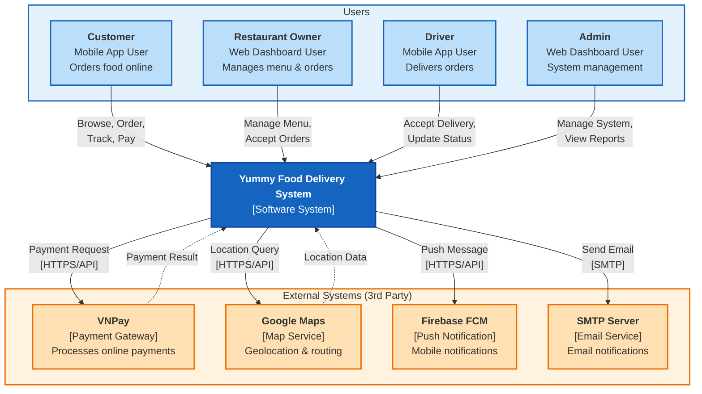

# C4 Diagram Level 1 - System Context Diagram

---

## 1. Tổng quan

System Context Diagram là cấp độ **thu nhỏ nhất** trong C4 Model. Nó cung cấp cái nhìn tổng quan về hệ thống trong bối cảnh rộng lớn hơn, tập trung vào:
- **Actors (Người dùng)**: Ai sử dụng hệ thống?
- **External Systems**: Hệ thống tích hợp với những hệ thống bên ngoài nào?
- **Relationships**: Các mối quan hệ và luồng dữ liệu giữa chúng

---

## 2. Actors (Người dùng)

| Actor | Vai trò | Tương tác với hệ thống |
|-------|---------|------------------------|
| **Customer** | Khách hàng đặt món | Duyệt menu, đặt đơn, thanh toán, theo dõi đơn hàng |
| **Restaurant Owner** | Chủ nhà hàng | Quản lý menu, nhận đơn, cập nhật trạng thái đơn |
| **Driver** | Tài xế giao hàng | Nhận assignment, cập nhật vị trí, xác nhận giao hàng |
| **Admin** | Quản trị viên | Quản lý users, restaurants, báo cáo, cấu hình hệ thống |

---

## 3. External Systems

| External System | Mô tả | Protocol |
|-----------------|-------|----------|
| **Payment Gateway** | VNPay - Xử lý thanh toán online | HTTPS/API |
| **Map Service** | Google Maps - Tính khoảng cách, định vị | HTTPS/API |
| **Push Notification** | Firebase Cloud Messaging - Gửi push notifications | HTTPS/API |
| **Email Service** | SMTP Server - Gửi email xác nhận, thông báo | SMTP |

---

## 4. Mermaid Diagram

---

## 5. Tóm tắt quan hệ

### 5.1. Actor → System

| Actor | Action | Description |
|-------|--------|-------------|
| Customer | Browses & Orders | Xem menu, đặt đơn, thanh toán, tracking |
| Restaurant Owner | Manages & Receives | Quản lý menu, nhận đơn, cập nhật trạng thái |
| Driver | Delivers | Nhận việc, cập nhật vị trí, xác nhận giao |
| Admin | Manages | Quản lý toàn bộ hệ thống |

### 5.2. System → External System

| Target | Protocol | Purpose |
|--------|----------|---------|
| Payment Gateway (VNPay) | HTTPS/REST | Xử lý thanh toán online |
| Map Service (Google Maps) | HTTPS/REST | Tính khoảng cách, định vị |
| Push Notification (FCM) | HTTPS/REST | Gửi thông báo đến app |
| Email Service (SMTP) | SMTP | Gửi email xác nhận |
