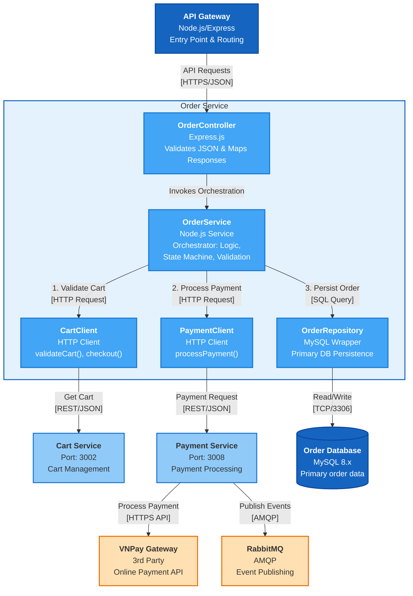

# C4 Diagram Level 3 - Component Diagram

---

## 1. Tổng quan

Component Diagram là cấp độ **Level 3** trong C4 Model. Nó phân rã bên trong từng **Container** (microservice) thành các **Component** - các thành phần logic như Controllers, Services, Repositories.

> **Ví dụ tiêu biểu**: Order Service

---

## 2. Cấu trúc Component tiêu chuẩn

Mỗi microservice trong hệ thống Yummy tuân theo **Layered Architecture**:

| Layer | Vai trò | Ví dụ |
|-------|---------|-------|
| **Routes** | Định nghĩa API endpoints | `order.routes.js` |
| **Controllers** | Xử lý HTTP request/response | `order.controller.js` |
| **Services** | Business logic | `order.service.js` |
| **Repositories** | Data access (CRUD) | `order.repository.js` |
| **Models** | Data structure/entities | `order.model.js` |
| **Clients** | Gọi external services | `cart-service.client.js` |

---

## 3. Order Service - Component Diagram

### 3.1. Tổng quan Order Service

| Thuộc tính | Giá trị |
|------------|---------|
| **Container** | Order Service |
| **Port** | 3003 |
| **Technology** | Node.js, Express, mysql2, axios |
| **Responsibility** | Quản lý đơn hàng, tích hợp Cart/Payment/Delivery |

### 3.2. Danh sách Components

#### 3.2.1. Routes Layer

| Component | File | Mô tả |
|-----------|------|-------|
| **Order Routes** | `routes/order.routes.js` | Định nghĩa các API endpoints cho order |

**Endpoints:**
| Method | Endpoint | Mô tả |
|--------|----------|-------|
| POST | `/orders` | Tạo đơn hàng mới |
| GET | `/orders/:orderId` | Xem chi tiết đơn hàng |
| GET | `/orders` | Danh sách đơn hàng (query: userId, status) |
| GET | `/orders/user/:userId` | Đơn hàng theo userId |
| POST | `/orders/:orderId/pay` | Thanh toán đơn hàng |
| POST | `/orders/:orderId/confirm` | Xác nhận đơn hàng |
| PUT | `/orders/:orderId/status` | Cập nhật trạng thái |
| POST | `/orders/:orderId/cancel` | Huỷ đơn hàng |

---

#### 3.2.2. Controllers Layer

| Component | File | Mô tả |
|-----------|------|-------|
| **Order Controller** | `controllers/order.controller.js` | Xử lý HTTP requests, gọi Service layer |

**Functions:**
| Function | HTTP | Mô tả |
|----------|------|-------|
| `createOrder()` | POST /orders | Tạo đơn hàng từ giỏ hàng |
| `getOrderById()` | GET /orders/:id | Lấy chi tiết đơn hàng |
| `listOrders()` | GET /orders | Danh sách đơn (với filter) |
| `getOrdersByUserId()` | GET /orders/user/:id | Đơn hàng của user |
| `payOrder()` | POST /orders/:id/pay | Xử lý thanh toán |
| `confirmOrder()` | POST /orders/:id/confirm | Xác nhận đơn hàng |
| `updateOrderStatus()` | PUT /orders/:id/status | Cập nhật trạng thái |
| `cancelOrder()` | POST /orders/:id/cancel | Huỷ đơn hàng |

---

#### 3.2.3. Services Layer (Business Logic)

| Component | File | Mô tả |
|-----------|------|-------|
| **Order Service** | `services/order.service.js` | Chứa nghiệp vụ xử lý đơn hàng |

**Business Logic Functions:**
| Function | Logic |
|----------|-------|
| `createOrder(userId)` | Validate cart → Tạo order → Checkout cart |
| `getOrderById(orderId)` | Lấy order với items |
| `getOrders(userId, status)` | Filter orders theo user và status |
| `payOrder(orderId)` | Gọi Payment Service → Update status |
| `confirmOrder(orderId)` | Validate status → Update to confirmed |
| `updateOrderStatus()` | State machine: pending → confirmed → completed |
| `cancelOrder(orderId)` | Validate cancellable → Update to cancelled |

**Order State Machine:**
```
pending_payment → pending → confirmed → completed
       ↓             ↓           ↓
    cancelled    cancelled    (không thể huỷ)
```

---

#### 3.2.4. Repositories Layer (Data Access)

| Component | File | Mô tả |
|-----------|------|-------|
| **Order Repository** | `repositories/order.repository.js` | CRUD cho bảng `orders` |
| **OrderItem Repository** | `repositories/order-item.repository.js` | CRUD cho bảng `order_items` |

**Order Repository Functions:**
| Function | SQL | Mô tả |
|----------|-----|-------|
| `create()` | INSERT | Tạo order mới |
| `findById()` | SELECT | Tìm order theo ID |
| `findByUserId()` | SELECT | Lấy orders của user |
| `updateStatus()` | UPDATE | Cập nhật trạng thái |

**OrderItem Repository Functions:**
| Function | SQL | Mô tả |
|----------|-----|-------|
| `createBulk()` | INSERT | Tạo nhiều items cùng lúc |
| `findByOrderId()` | SELECT | Lấy items của order |

---

#### 3.2.5. Models Layer (Data Structure)

| Component | File | Mô tả |
|-----------|------|-------|
| **Order Model** | `models/order.model.js` | Entity Order |
| **OrderItem Model** | `models/order-item.model.js` | Entity OrderItem |

**Order Entity:**
| Field | Type | Mô tả |
|-------|------|-------|
| `orderId` | INT | Primary key |
| `userId` | INT | FK → User |
| `cartId` | INT | FK → Cart |
| `status` | ENUM | pending_payment, pending, confirmed, completed, cancelled |
| `totalAmount` | DECIMAL | Tổng tiền |
| `totalItems` | INT | Số lượng items |
| `createdAt` | DATETIME | Thời gian tạo |
| `updatedAt` | DATETIME | Thời gian cập nhật |

---

#### 3.2.6. Clients Layer (External Service Integration)

| Component | File | Target Service | Protocol |
|-----------|------|----------------|----------|
| **Cart Service Client** | `clients/cart-service.client.js` | Cart Service | HTTP/REST |
| **Payment Service Client** | `clients/payment-service.client.js` | Payment Service | HTTP/REST |
| **Delivery Service Client** | `clients/delivery-service.client.js` | Delivery Service | HTTP/REST |

**Cart Service Client Functions:**
| Function | HTTP Call | Mô tả |
|----------|-----------|-------|
| `validateCart(userId)` | POST /validate | Kiểm tra giỏ hàng hợp lệ |
| `getCart(userId)` | GET /user/:userId | Lấy giỏ hàng |
| `checkout(cartId)` | POST /checkout | Checkout giỏ hàng |

**Payment Service Client Functions:**
| Function | HTTP Call | Mô tả |
|----------|-----------|-------|
| `pay(orderId, amount)` | POST /pay | Xử lý thanh toán |

**Delivery Service Client Functions:**
| Function | HTTP Call | Mô tả |
|----------|-----------|-------|
| `createDelivery(orderData)` | POST /deliveries | Tạo đơn giao hàng |

---

## 4. Mermaid Diagram - Order Service Components



### Legend

| Color | Type | Description |
|-------|------|-------------|
| 🔵 Dark Blue | Container | Main service boundary |
| 🔵 Blue | Component | Internal components (Controller, Service, Repository) |
| 🔵 Light Blue | Database | Data storage |
| ⚪ Light Blue Border | External Service | Other microservices |
| 🟠 Orange | 3rd Party | External systems (VNPay, RabbitMQ) |

---

## 5. Component Dependencies

### 4.1. Internal Dependencies (trong Order Service)

```
Routes → Controller → Service → Repository → Database
                         ↓
                      Clients → External Services
```

### 4.2. Chi tiết luồng tạo đơn hàng

| Step | Component | Action |
|------|-----------|--------|
| 1 | Order Routes | Nhận POST /orders |
| 2 | Order Controller | Parse request, gọi Service |
| 3 | Order Service | Gọi Cart Client để validate |
| 4 | Cart Service Client | HTTP → Cart Service |
| 5 | Order Service | Gọi Order Repository để create |
| 6 | Order Repository | INSERT vào database |
| 7 | Order Service | Gọi OrderItem Repository |
| 8 | OrderItem Repository | INSERT items |
| 9 | Order Service | Gọi Cart Client checkout |
| 10 | Cart Service Client | HTTP → Cart Service |
| 11 | Order Controller | Return response |

### 4.3. Chi tiết luồng thanh toán (Payment Flow)

| Step | Component | Action |
|------|-----------|--------|
| 1 | Order Routes | Nhận POST /orders/:orderId/pay |
| 2 | Order Controller | Parse orderId, gọi `payOrder()` |
| 3 | Order Service | Validate order status = `pending_payment` |
| 4 | Order Service | Gọi Payment Service Client |
| 5 | Payment Service Client | HTTP POST → Payment Service `/pay` |
| 6 | Payment Service | Gọi VNPay API (3rd party) |
| 7 | VNPay | Xử lý thanh toán, trả về kết quả |
| 8 | Payment Service | Publish `payment.success` → RabbitMQ |
| 9 | Payment Service Client | Return payment result |
| 10 | Order Service | Update order status → `pending` |
| 11 | Order Repository | UPDATE trong database |
| 12 | Order Controller | Return response |

**Sequence Diagram (Text):**
```
Customer   →   Mobile App   →   API Gateway   →   Order Service   →   Payment Service   →   VNPay
    │               │                │                  │                   │                │
    │  Tap Pay      │                │                  │                   │                │
    │──────────────►│                │                  │                   │                │
    │               │  POST /orders  │                  │                   │                │
    │               │  /{id}/pay     │                  │                   │                │
    │               │───────────────►│                  │                   │                │
    │               │                │  Route to Order  │                   │                │
    │               │                │─────────────────►│                   │                │
    │               │                │                  │  POST /pay        │                │
    │               │                │                  │  {orderId, amount}│                │
    │               │                │                  │──────────────────►│                │
    │               │                │                  │                   │  HTTPS/API     │
    │               │                │                  │                   │───────────────►│
    │               │                │                  │                   │                │
    │               │                │                  │                   │◄───────────────│
    │               │                │                  │                   │  Payment Result│
    │               │                │                  │                   │                │
    │               │                │                  │                   │─┐              │
    │               │                │                  │                   │ │ Publish      │
    │               │                │                  │                   │ │ payment.success
    │               │                │                  │                   │◄┘ → RabbitMQ   │
    │               │                │                  │◄──────────────────│                │
    │               │                │                  │  {success: true}  │                │
    │               │                │                  │                   │                │
    │               │                │                  │─┐                 │                │
    │               │                │                  │ │ Update status   │                │
    │               │                │                  │ │ → pending       │                │
    │               │                │                  │◄┘                 │                │
    │               │                │◄─────────────────│                   │                │
    │               │◄───────────────│  {order}         │                   │                │
    │◄──────────────│  Payment OK    │                  │                   │                │
```

### 4.4. Inter-Service Communication Summary

| From | To | Protocol | Endpoint | Purpose |
|------|----|----------|----------|---------|
| Order Service | Cart Service | HTTP/REST | POST /validate | Validate cart trước khi tạo order |
| Order Service | Cart Service | HTTP/REST | GET /user/:userId | Lấy cart items |
| Order Service | Cart Service | HTTP/REST | POST /checkout | Checkout cart sau khi tạo order |
| **Order Service** | **Payment Service** | **HTTP/REST** | **POST /pay** | **Thanh toán đơn hàng** |
| Order Service | Delivery Service | HTTP/REST | POST /deliveries | Tạo đơn giao hàng |
| Payment Service | VNPay | HTTPS/API | External API | Xử lý thanh toán online |
| Payment Service | RabbitMQ | AMQP | Publish | Event `payment.success` |

---

## 5. Các Service khác (Tổng quan)

### 5.1. User Service Components

| Component | Mô tả |
|-----------|-------|
| Auth Controller | Xử lý register/login |
| User Service | Business logic xác thực |
| User Repository | CRUD users |
| JWT Utils | Generate/verify tokens |

### 5.2. Restaurant Service Components

| Component | Mô tả |
|-----------|-------|
| Restaurant Controller | CRUD restaurants |
| Category Controller | CRUD categories |
| Item Controller | CRUD menu items |
| Option Controller | CRUD options |
| Restaurant Service | Business logic |
| Restaurant Repository | Data access |

### 5.3. Notification Service Components

| Component | Mô tả |
|-----------|-------|
| Notification Controller | REST API |
| RabbitMQ Consumer | Consume events |
| Notification Service | Send push/email |
| Device Token Repository | Manage FCM tokens |

---

## 6. Tổng kết

| Level | Focus | Audience |
|-------|-------|----------|
| **Level 1** | System Context | Business/Stakeholders |
| **Level 2** | Containers (Microservices) | Architects |
| **Level 3** | Components (Controllers, Services) | Developers |
| **Level 4** | Code (Classes, Functions) | Developers (optional) |
