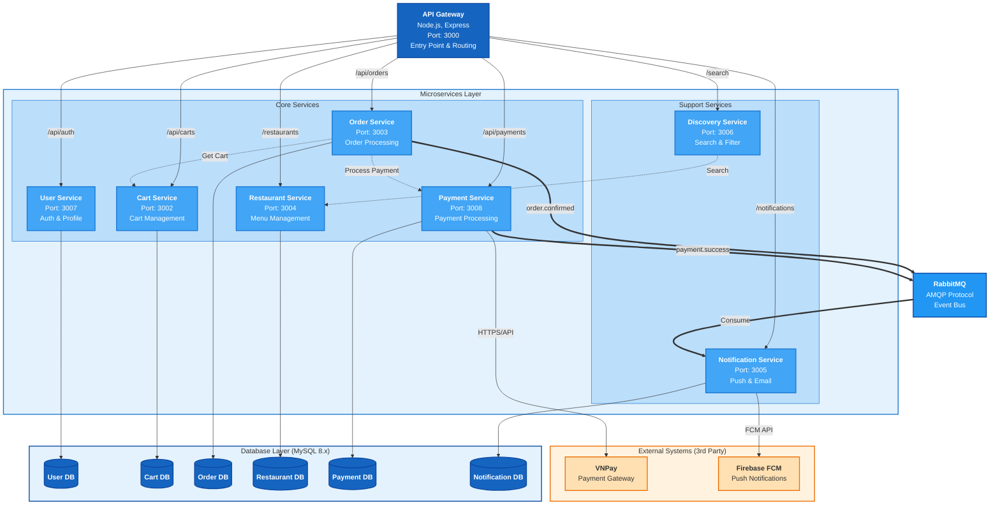

# C4 Diagram Level 2 - Container Diagram

---

## 1. Tổng quan

Container Diagram thể hiện các thành phần có thể triển khai độc lập trong hệ thống Yummy Food Delivery, bao gồm các microservices, databases, message broker, và mobile application.

---

## 2. Danh sách Containers

### 2.1. Mobile Application

| Container | Công nghệ | Mô tả | Port |
|-----------|-----------|-------|------|
| **Mobile App** | Flutter (Dart) | Ứng dụng di động cho khách hàng đặt món ăn | - |

### 2.2. API Gateway

| Container | Công nghệ | Mô tả | Port |
|-----------|-----------|-------|------|
| **API Gateway** | Node.js, Express, http-proxy-middleware | Điểm truy cập duy nhất, routing requests đến các microservices | 3000 |

### 2.3. Microservices

| Container | Công nghệ | Mô tả | Port |
|-----------|-----------|-------|------|
| **User Service** | Node.js, Express, Sequelize, JWT, bcrypt | Xác thực người dùng (Register/Login), quản lý JWT tokens | 3007 |
| **Cart Service** | Node.js, Express, mysql2 | Quản lý giỏ hàng (thêm/xóa/cập nhật items) | 3002 |
| **Order Service** | Node.js, Express, mysql2, axios | Xử lý đơn hàng, gọi Cart/Payment/Delivery services | 3003 |
| **Restaurant Service** | Node.js, Express, Sequelize, UUID | Quản lý nhà hàng, menu categories, menu items, options | 3004 |
| **Discovery Service** | Node.js, Express, axios | Tìm kiếm món ăn/nhà hàng, aggregation từ Restaurant Service | 3006 |
| **Notification Service** | Node.js, Express, Sequelize, amqplib | Gửi push/email notifications, consume events từ RabbitMQ | 3005 |
| **Payment Service** | Node.js, Express, mysql2, axios | Xử lý thanh toán, tích hợp VNPay | 3008 |
| **Promotion Service** | Node.js, Express, mysql2 | Quản lý khuyến mãi, mã giảm giá | TBD |
| **Review Service** | Node.js, Express, mysql2 | Quản lý đánh giá, nhận xét của người dùng | TBD |

### 2.4. Databases

| Container | Công nghệ | Mô tả |
|-----------|-----------|-------|
| **User DB** | MySQL 8.x | Lưu trữ thông tin users, credentials |
| **Cart DB** | MySQL 8.x | Lưu trữ carts, cart_items |
| **Order DB** | MySQL 8.x | Lưu trữ orders, order_items |
| **Restaurant DB** | MySQL 8.x | Lưu trữ restaurants, categories, items, options |
| **Payment DB** | MySQL 8.x | Lưu trữ transactions, payment history |
| **Notification DB** | MySQL 8.x | Lưu trữ notifications, device_tokens |
| **Promotion DB** | MySQL 8.x | Lưu trữ promotions |
| **Review DB** | MySQL 8.x | Lưu trữ reviews |

### 2.5. Message Broker

| Container | Công nghệ | Mô tả |
|-----------|-----------|-------|
| **RabbitMQ** | RabbitMQ 3.x | Message broker cho event-driven architecture |

---

## 3. Giao tiếp giữa các Containers

### 3.1. Protocols

| Giao thức | Sử dụng cho |
|-----------|-------------|
| **HTTPS/REST** | Mobile App ↔ API Gateway |
| **HTTP/REST** | API Gateway ↔ Microservices |
| **HTTP/REST** | Microservices ↔ Microservices (inter-service) |
| **AMQP** | Microservices → RabbitMQ → Notification Service |
| **TCP** | Microservices ↔ MySQL Databases |

### 3.2. Chi tiết giao tiếp

```
┌─────────────────────────────────────────────────────────────────────────────┐
│                              EXTERNAL USERS                                 │
└─────────────────────────────────────────────────────────────────────────────┘
                                      │
                                      │ HTTPS/REST
                                      ▼
┌─────────────────────────────────────────────────────────────────────────────┐
│                            Mobile App (Flutter)                             │
│                          Ứng dụng khách hàng                                │
└─────────────────────────────────────────────────────────────────────────────┘
                                      │
                                      │ HTTPS/REST
                                      ▼
┌─────────────────────────────────────────────────────────────────────────────┐
│                          API Gateway (Port 3000)                            │
│                    Node.js + Express + http-proxy-middleware                │
│                                                                              │
│  Routes:                                                                     │
│  /api/auth/*      → User Service      /api/carts/*    → Cart Service        │
│  /api/orders/*    → Order Service     /restaurants/*  → Restaurant Service  │
│  /search/*        → Discovery Service /notifications/*→ Notification Service│
└─────────────────────────────────────────────────────────────────────────────┘
         │              │              │              │              │
         │HTTP          │HTTP          │HTTP          │HTTP          │HTTP
         ▼              ▼              ▼              ▼              ▼
┌──────────────┐ ┌──────────────┐ ┌──────────────┐ ┌──────────────┐ ┌──────────────┐
│    User      │ │    Cart      │ │    Order     │ │  Restaurant  │ │   Discovery  │
│ Service      │ │ Service      │ │ Service      │ │ Service      │ │ Service      │
│ (3007)       │ │ (3002)       │ │ (3003)       │ │ (3004)       │ │ (3006)       │
│              │ │              │ │              │ │              │ │              │
│ Express      │ │ Express      │ │ Express      │ │ Express      │ │ Express      │
│ Sequelize    │ │ mysql2       │ │ mysql2       │ │ Sequelize    │ │ axios        │
│ JWT, bcrypt  │ │              │ │ axios        │ │ UUID         │ │              │
└──────┬───────┘ └──────┬───────┘ └──────┬───────┘ └──────┬───────┘ └──────┬───────┘
       │                │                │                │                │
       │TCP             │TCP             │TCP             │TCP             │HTTP
       ▼                ▼                ▼                ▼                ▼
┌──────────────┐ ┌──────────────┐ ┌──────────────┐ ┌──────────────┐ ┌──────────────┐
│ 💾 User DB   │ │ 💾 Cart DB   │ │ 💾 Order DB  │ │ 💾 Restaurant│ │ Restaurant   │
│ (MySQL)      │ │ (MySQL)      │ │ (MySQL)      │ │ DB (MySQL)   │ │ Service      │
└──────────────┘ └──────────────┘ └──────────────┘ └──────────────┘ └──────────────┘

┌──────────────┐ ┌──────────────┐ ┌──────────────┐
│  Promotion   │ │  Review      │ │  Notification│
│ Service      │ │ Service      │ │ Service (3005)│
│              │ │              │ │               │
│ Express      │ │ Express      │ │ Express       │
│ mysql2       │ │ mysql2       │ │ Sequelize     │
│              │ │              │ │ amqplib       │
└──────┬───────┘ └──────┬───────┘ └───────┬───────┘
       │                │                 │
       │TCP             │TCP              │TCP + AMQP
       ▼                ▼                 ▼
┌──────────────┐ ┌──────────────┐ ┌──────────────┐  ┌──────────────┐
│  Promotion   │ │   Review DB  │ │  Notif DB    │  │   RabbitMQ   │
│ DB (MySQL)   │ │ (MySQL)      │ │ (MySQL)      │  │ (AMQP)       │
└──────────────┘ └──────────────┘ └──────────────┘  └──────────────┘
                                                           ▲
                                                           │ AMQP Publish
                    ┌──────────────────────────────────────┤
                    │                                      │
             ┌──────┴───────┐                      ┌───────┴──────┐
             │ Order Service│                      │ User Service │
             │ (Events:     │                      │ (Events:     │
             │ order.*)     │                      │ user.*)      │
             └──────────────┘                      └──────────────┘
```

---

## 4. Inter-Service Communication

### 4.1. Synchronous (HTTP/REST)

| Source | Target | Protocol | Mục đích |
|--------|--------|----------|----------|
| Order Service | Cart Service | HTTP/REST | Lấy giỏ hàng, validate, checkout |
| Order Service | Payment Service* | HTTP/REST | Xử lý thanh toán |
| Order Service | Delivery Service* | HTTP/REST | Tạo đơn giao hàng |
| Discovery Service | Restaurant Service | HTTP/REST | Tìm kiếm món ăn/nhà hàng |

> *Payment Service và Delivery Service chưa được implement trong codebase hiện tại

### 4.2. Asynchronous (AMQP/RabbitMQ)

| Publisher | Event | Consumer | Mục đích |
|-----------|-------|----------|----------|
| Order Service | `order.confirmed` | Notification Service | Thông báo đơn hàng được xác nhận |
| Order Service | `order.delivered` | Notification Service | Thông báo giao hàng thành công |
| Payment Service* | `payment.success` | Notification Service | Thông báo thanh toán thành công |
| User Service | `user.registered` | Notification Service | Gửi email chào mừng |

---

## 5. Mermaid Diagram



### Legend

| Color | Type | Description |
|-------|------|-------------|
| 🔵 Light Blue | Actor/Client | Users and client applications |
| 🔵 Dark Blue | Container | API Gateway, Services |
| 🔵 Blue | Database | MySQL databases |
| 🟢 Cyan | Message Broker | RabbitMQ event bus |
| 🟠 Orange | External System | 3rd party (VNPay, FCM) |

### Arrow Types

| Arrow | Meaning |
|-------|---------|
| `→` (solid) | Synchronous HTTP/REST call |
| `⇢` (dashed) | Inter-service communication |
| `⇒` (thick) | Async event via RabbitMQ |
