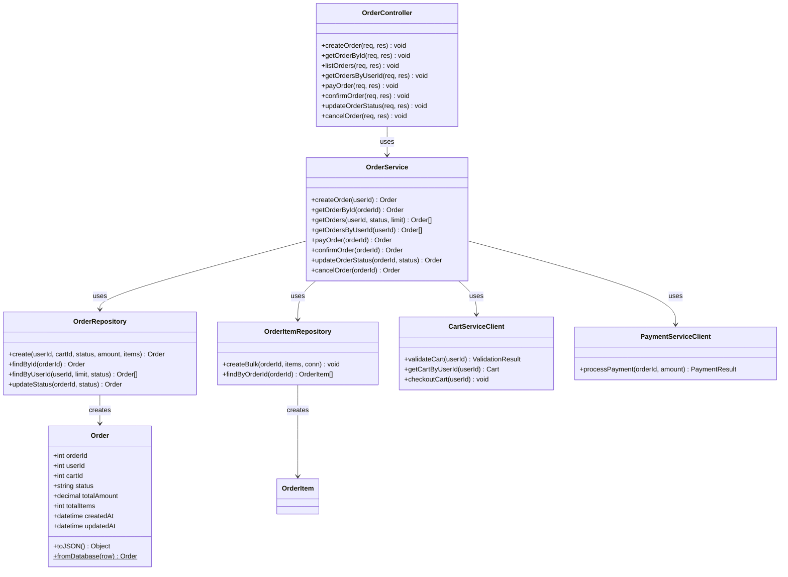
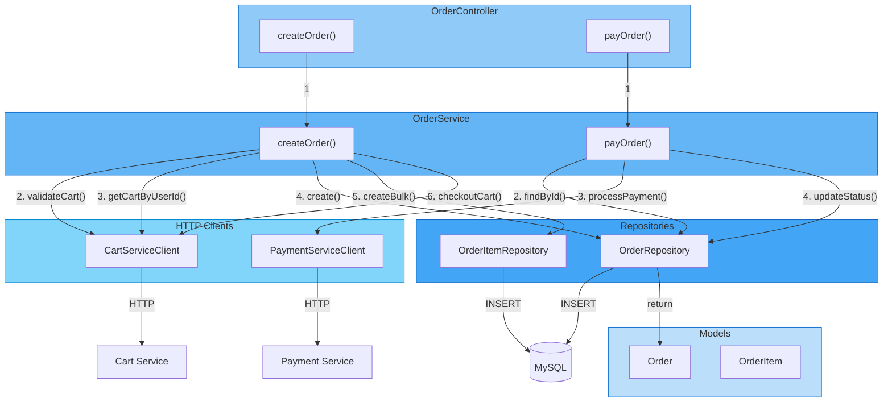

# C4 Diagram Level 4 - Code Diagram

---

## 1. Tổng quan

Code Diagram là cấp độ **chi tiết nhất** trong C4 Model. Nó mô tả cấu trúc mã nguồn ở mức **lớp (class)** hoặc **hàm (function)**, tập trung vào mối quan hệ giữa các thành phần code.

---

## 2. Order Service - Class Diagram

### 2.1. Các lớp chính



---

## 3. Chi tiết từng Class

### 3.1. Order (Model)

| Thuộc tính | Kiểu | Mô tả |
|------------|------|-------|
| `orderId` | int | Primary key |
| `userId` | int | FK → User |
| `cartId` | int | FK → Cart |
| `status` | string | pending_payment, pending, confirmed, completed, cancelled |
| `totalAmount` | decimal | Tổng tiền đơn hàng |
| `totalItems` | int | Số lượng items |
| `createdAt` | datetime | Thời gian tạo |
| `updatedAt` | datetime | Thời gian cập nhật |

| Method | Return | Mô tả |
|--------|--------|-------|
| `toJSON()` | Object | Chuyển thành JSON object |
| `fromDatabase(row)` | Order | Static method - tạo từ DB row |

---

### 3.2. OrderController

| Method | HTTP | Mô tả |
|--------|------|-------|
| `createOrder(req, res)` | POST /orders | Tạo đơn hàng mới từ giỏ hàng |
| `getOrderById(req, res)` | GET /orders/:id | Lấy chi tiết đơn hàng |
| `listOrders(req, res)` | GET /orders | Danh sách đơn với filter |
| `getOrdersByUserId(req, res)` | GET /orders/user/:id | Đơn hàng của user |
| `payOrder(req, res)` | POST /orders/:id/pay | Thanh toán đơn hàng |
| `confirmOrder(req, res)` | POST /orders/:id/confirm | Xác nhận đơn hàng |
| `updateOrderStatus(req, res)` | PUT /orders/:id/status | Cập nhật trạng thái |
| `cancelOrder(req, res)` | POST /orders/:id/cancel | Huỷ đơn hàng |

---

### 3.3. OrderService (Business Logic)

| Method | Params | Return | Logic |
|--------|--------|--------|-------|
| `createOrder` | userId | Order | 1. Validate cart → 2. Get cart → 3. Create order → 4. Create items → 5. Checkout |
| `getOrderById` | orderId | Order | Lấy order + items |
| `getOrders` | userId, status?, limit? | Order[] | Filter theo user và status |
| `payOrder` | orderId | Order | 1. Validate status → 2. Call Payment → 3. Update status |
| `confirmOrder` | orderId | Order | Validate pending → Update to confirmed |
| `updateOrderStatus` | orderId, status | Order | State machine validation |
| `cancelOrder` | orderId | Order | Validate cancellable → Update to cancelled |

**State Machine:**
```
pending_payment ──pay──→ pending ──confirm──→ confirmed ──complete──→ completed
       │                    │
       └────cancel────→ cancelled ←────cancel────┘
```

---

### 3.4. OrderRepository (Data Access)

| Method | SQL | Mô tả |
|--------|-----|-------|
| `create(userId, cartId, status, amount, items)` | INSERT INTO orders | Tạo order mới, return Order |
| `findById(orderId)` | SELECT * FROM orders WHERE order_id = ? | Tìm order theo ID |
| `findByUserId(userId, limit, status)` | SELECT * FROM orders WHERE user_id = ? | Lấy orders của user |
| `updateStatus(orderId, status)` | UPDATE orders SET status = ? | Cập nhật trạng thái |

---

### 3.5. CartServiceClient (HTTP Client)

| Method | HTTP Call | Return | Mô tả |
|--------|-----------|--------|-------|
| `validateCart(userId)` | POST /api/carts/validate | `{valid, itemsToFix[]}` | Kiểm tra giỏ hàng hợp lệ |
| `getCartByUserId(userId)` | GET /api/carts/user/:userId | Cart with items | Lấy giỏ hàng |
| `checkoutCart(userId)` | POST /api/carts/checkout | void | Đóng giỏ hàng sau khi tạo order |

---

### 3.6. PaymentServiceClient (HTTP Client)

| Method | HTTP Call | Return | Mô tả |
|--------|-----------|--------|-------|
| `processPayment(orderId, amount)` | POST /api/payments/pay | `{success, transactionId}` | Xử lý thanh toán |

---

## 4. Mermaid Diagram - Code Flow



---

## 5. Tổng kết các Level

| Level | Focus | Audience | Order Service Example |
|-------|-------|----------|----------------------|
| **Level 1** | System Context | Business | Yummy System + External |
| **Level 2** | Containers | Architects | Order Service container |
| **Level 3** | Components | Developers | Controller, Service, Repository |
| **Level 4** | Code | Developers | Class Order, functions |
