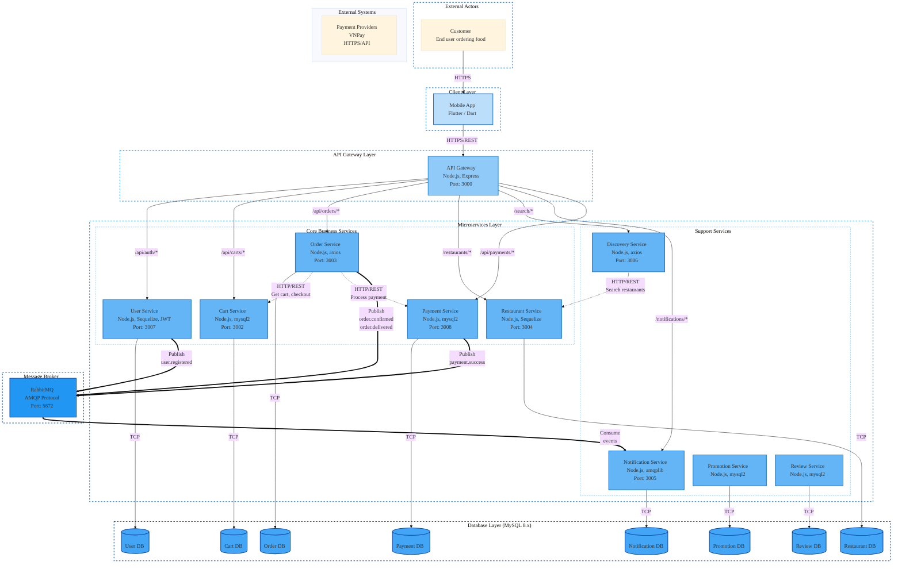

# SA25-26_ClassN01_Group05

This repository contains all source code and project-related documents for the course project.

## Repository Structure

- **Documents/**  
  Contains all project documentation, including the project plan, Software Requirements Specification (SRS), and weekly lab reports. This folder serves as a central reference for tracking project progress and maintaining organized documentation for the team and instructors.

- **Design/**  
  Contains all design-related documents, covering system architecture, functional design, and database/data design. These files help visualize the system's structure and workflow, ensuring consistency during development.

- **SRC/**  
  Contains the source code of the project.

- **README.md**  
  Provides an overview of the project, instructions, and other essential information for understanding and using the repository.

- **CHANGELOG.md**  
  Tracks all changes and updates made to the project, including new features, bug fixes, and improvements.

