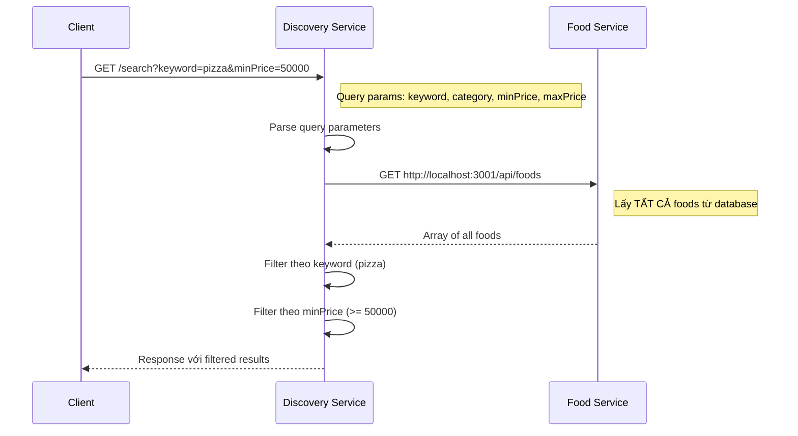
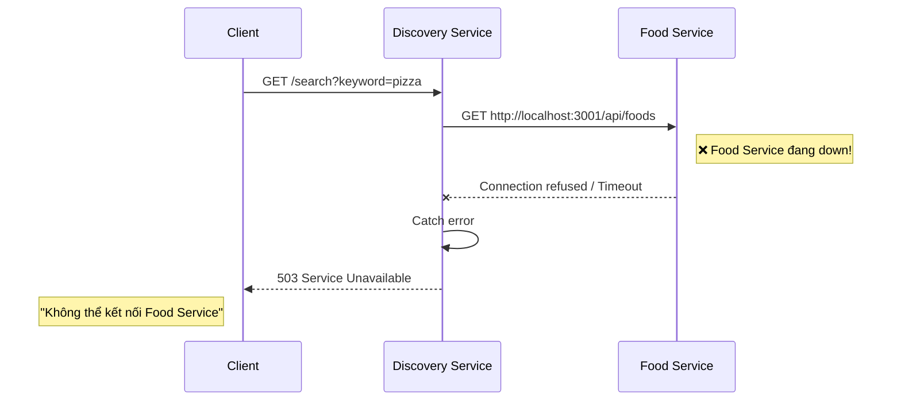

# 📖 Tài liệu Discovery Service

## 1. Giới thiệu

**Discovery Service** là microservice chịu trách nhiệm xử lý **tìm kiếm food và restaurants** trong hệ thống Yummy Food Delivery.

### Thông tin cơ bản
| Thuộc tính | Giá trị |
|------------|---------|
| **Port** | 3003 |
| **Database** | Không có (lấy dữ liệu từ Food Service) |
| **Giao tiếp** | HTTP (axios) |

### Đặc điểm quan trọng
> ⚠️ **Discovery Service KHÔNG có database riêng cho Food.**
> 
> Dữ liệu Food được quản lý bởi **Restaurant Service** (Food Service - port 3001).
> Discovery Service gọi HTTP đến Food Service để lấy dữ liệu và thực hiện filter.

---

## 2. Kiến trúc Microservices Communication

```
┌─────────────────┐     HTTP      ┌─────────────────┐
│                 │   Request     │                 │
│     CLIENT      │──────────────▶│   DISCOVERY     │
│   (Mobile/Web)  │               │    SERVICE      │
│                 │◀──────────────│   (Port 3003)   │
│                 │   Response    │                 │
└─────────────────┘               └────────┬────────┘
                                           │
                                           │ HTTP (axios)
                                           │ GET /api/foods
                                           ▼
                                  ┌─────────────────┐
                                  │                 │
                                  │  FOOD SERVICE   │
                                  │   (Port 3001)   │
                                  │                 │
                                  └────────┬────────┘
                                           │
                                           ▼
                                  ┌─────────────────┐
                                  │                 │
                                  │   MySQL DB      │
                                  │  (foods table)  │
                                  │                 │
                                  └─────────────────┘
```

### Tại sao lại thiết kế như vậy?

1. **Separation of Concerns**: Mỗi service chỉ làm một việc
   - Food Service: CRUD operations cho food
   - Discovery Service: Tìm kiếm, filter, aggregate

2. **Single Source of Truth**: Dữ liệu Food chỉ ở một nơi (Food Service DB)

3. **Scalability**: Có thể scale Discovery Service độc lập khi cần tìm kiếm nhiều

---

## 3. Kiến trúc nội bộ

```
┌─────────────────────────────────────────────────────────────┐
│                      CLIENT (Mobile/Web)                     │
└─────────────────────────────────────────────────────────────┘
                              │
                              ▼ GET /search?keyword=...
┌─────────────────────────────────────────────────────────────┐
│                   ROUTES (search.routes.js)                  │
│              Định nghĩa endpoint: GET /search                │
└─────────────────────────────────────────────────────────────┘
                              │
                              ▼
┌─────────────────────────────────────────────────────────────┐
│             CONTROLLER (search.controller.js)                │
│      Nhận query params, gọi service, trả response            │
└─────────────────────────────────────────────────────────────┘
                              │
                              ▼
┌─────────────────────────────────────────────────────────────┐
│               SERVICE (search.service.js)                    │
│   1. Gọi HTTP đến Food Service                               │
│   2. Filter kết quả theo keyword, category, price            │
│   3. Trả về danh sách food phù hợp                           │
└─────────────────────────────────────────────────────────────┘
                              │
                              ▼ HTTP GET
┌─────────────────────────────────────────────────────────────┐
│              FOOD SERVICE (External - Port 3001)             │
└─────────────────────────────────────────────────────────────┘
```

---

## 4. Flow Tìm kiếm (Search)



### Chi tiết các bước:

1. **Client gửi request** với query parameters
   ```
   GET /search?keyword=pizza&minPrice=50000
   ```

2. **Controller parse** các query params
   ```javascript
   const { keyword, category, minPrice, maxPrice } = req.query;
   ```

3. **Service gọi HTTP** đến Food Service
   ```javascript
   const response = await axios.get('http://localhost:3001/api/foods');
   let foods = response.data;
   ```

4. **Filter theo keyword** (tìm trong tên food)
   ```javascript
   foods = foods.filter(food => 
       food.name.toLowerCase().includes(keyword.toLowerCase())
   );
   ```

5. **Filter theo price** (giá tối thiểu/tối đa)
   ```javascript
   foods = foods.filter(food => food.price >= minPrice);
   ```

6. **Trả về kết quả** đã filter

---

## 5. Xử lý lỗi khi Food Service không available



### Trong thực tế production:

Có thể cải thiện bằng các pattern:
- **Caching**: Cache kết quả từ Food Service
- **Circuit Breaker**: Ngắt kết nối khi service liên tục fail
- **Fallback**: Trả về dữ liệu từ cache nếu service down

---

## 6. API Reference

### GET /search

Tìm kiếm food với các filter.

**Query Parameters:**

| Parameter | Kiểu | Mô tả | Ví dụ |
|-----------|------|-------|-------|
| `keyword` | string | Tìm trong tên food | `?keyword=pizza` |
| `category` | string | Lọc theo danh mục | `?category=vietnamese` |
| `minPrice` | number | Giá tối thiểu | `?minPrice=30000` |
| `maxPrice` | number | Giá tối đa | `?maxPrice=100000` |

**Ví dụ requests:**
```bash
# Tìm tất cả food có tên chứa "pizza"
GET /search?keyword=pizza

# Tìm food giá từ 30,000 đến 100,000
GET /search?minPrice=30000&maxPrice=100000

# Kết hợp nhiều filter
GET /search?keyword=burger&category=fastfood&minPrice=50000
```

**Response thành công (200):**
```json
{
    "message": "Tìm kiếm thành công",
    "count": 5,
    "filters": {
        "keyword": "pizza",
        "category": null,
        "minPrice": 50000,
        "maxPrice": null
    },
    "data": [
        {
            "id": 1,
            "name": "Pizza Margherita",
            "price": 89000,
            "restaurantId": 1
        },
        {
            "id": 2,
            "name": "Pizza Pepperoni",
            "price": 99000,
            "restaurantId": 1
        }
    ]
}
```

**Response lỗi (503):**
```json
{
    "error": "Lỗi tìm kiếm",
    "details": "Không thể kết nối Food Service: connect ECONNREFUSED"
}
```

---

## 7. Error Codes

| HTTP Code | Ý nghĩa | Nguyên nhân |
|-----------|---------|-------------|
| 200 | OK | Tìm kiếm thành công (có thể trả về mảng rỗng) |
| 503 | Service Unavailable | Không thể kết nối Food Service |
| 500 | Server Error | Lỗi không xác định |

---

## 8. Cấu hình

### File .env

```env
# Port của Discovery Service
PORT=3003

# URL của Food Service (quan trọng!)
FOOD_SERVICE_URL=http://localhost:3001/api/foods
```

### Dependencies

```json
{
    "axios": "^1.6.2",      // HTTP client để gọi Food Service
    "dotenv": "^16.3.1",    // Đọc file .env
    "express": "^4.18.2"    // Web framework
}
```

---

## 9. Diagram tổng quan hệ thống

```
                    ┌──────────────────────────────────────────┐
                    │            YUMMY SYSTEM                   │
                    └──────────────────────────────────────────┘
                                       │
           ┌───────────────────────────┼───────────────────────────┐
           │                           │                           │
           ▼                           ▼                           ▼
    ┌─────────────┐            ┌─────────────┐            ┌─────────────┐
    │   USER      │            │  DISCOVERY  │            │    FOOD     │
    │  SERVICE    │            │   SERVICE   │───HTTP───▶│   SERVICE   │
    │  (3002)     │            │   (3003)    │            │   (3001)    │
    └──────┬──────┘            └─────────────┘            └──────┬──────┘
           │                                                      │
           │                                                      │
           ▼                                                      ▼
    ┌─────────────┐                                       ┌─────────────┐
    │   MySQL     │                                       │   MySQL     │
    │  users DB   │                                       │  foods DB   │
    └─────────────┘                                       └─────────────┘
```
