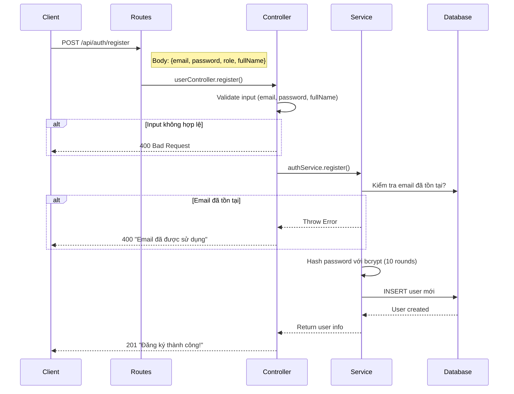
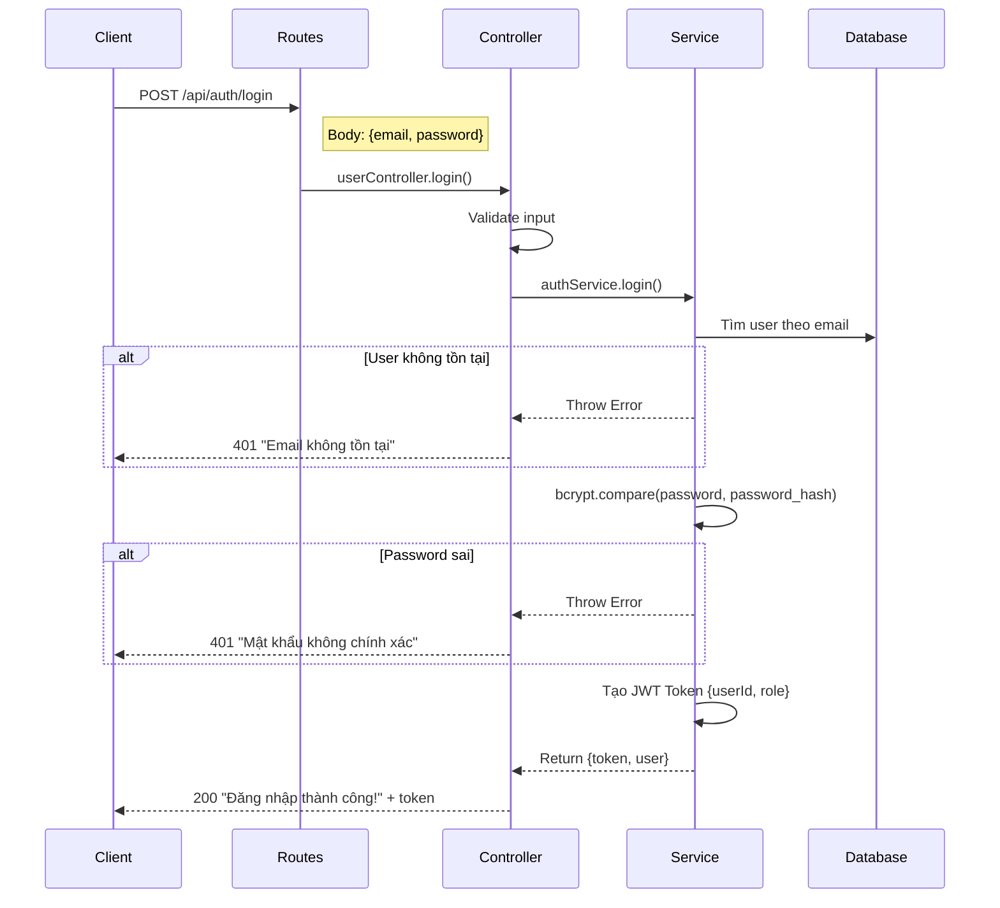
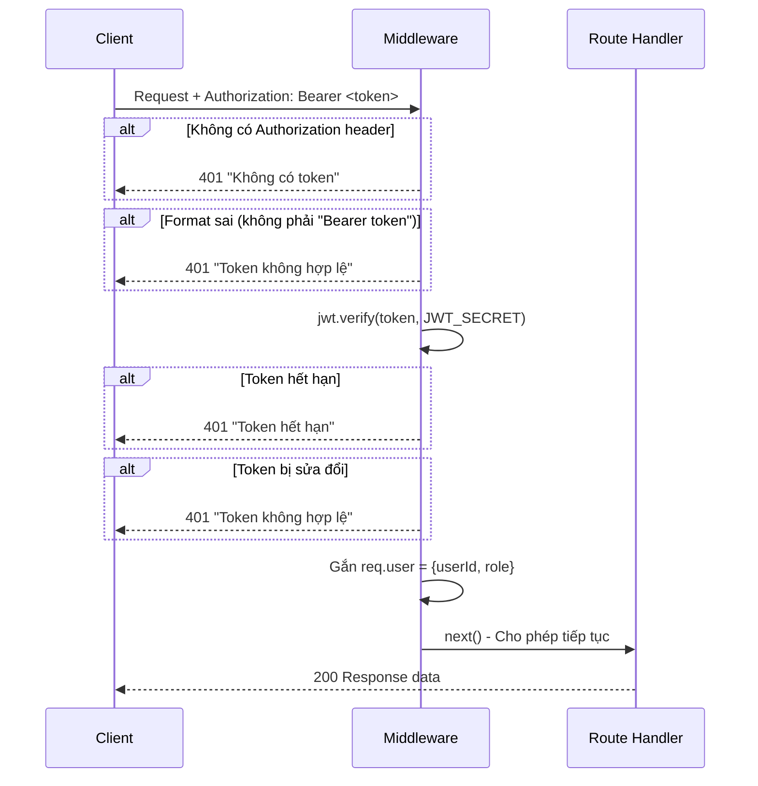

# 📖 Tài liệu User Service

## 1. Giới thiệu

**User Service** là microservice chịu trách nhiệm xử lý toàn bộ logic liên quan đến **xác thực người dùng (Authentication)** trong hệ thống Yummy Food Delivery.

### Thông tin cơ bản
| Thuộc tính | Giá trị |
|------------|---------|
| **Port** | 3002 |
| **Database** | MySQL (yummy_db) |
| **ORM** | Sequelize |
| **Authentication** | JWT (JSON Web Token) |

---

## 2. Kiến trúc Layered Architecture

```
┌─────────────────────────────────────────────────────────────┐
│                      CLIENT (Mobile/Web)                     │
└─────────────────────────────────────────────────────────────┘
                              │
                              ▼ HTTP Request
┌─────────────────────────────────────────────────────────────┐
│                     ROUTES (user.routes.js)                  │
│         Định nghĩa các endpoint: /register, /login          │
└─────────────────────────────────────────────────────────────┘
                              │
                              ▼
┌─────────────────────────────────────────────────────────────┐
│               MIDDLEWARE (verifyToken.js)                    │
│     Xác thực JWT Token cho các protected routes              │
└─────────────────────────────────────────────────────────────┘
                              │
                              ▼
┌─────────────────────────────────────────────────────────────┐
│              CONTROLLER (user.controller.js)                 │
│         Nhận request, validate input, gọi service            │
└─────────────────────────────────────────────────────────────┘
                              │
                              ▼
┌─────────────────────────────────────────────────────────────┐
│                SERVICE (auth.service.js)                     │
│     Xử lý business logic: hash password, tạo JWT             │
└─────────────────────────────────────────────────────────────┘
                              │
                              ▼
┌─────────────────────────────────────────────────────────────┐
│                  MODEL (user.model.js)                       │
│           Định nghĩa cấu trúc bảng User                      │
└─────────────────────────────────────────────────────────────┘
                              │
                              ▼
┌─────────────────────────────────────────────────────────────┐
│                    MySQL DATABASE                            │
│                  Bảng: users                                 │
└─────────────────────────────────────────────────────────────┘
```

---

## 3. Flow Đăng ký (Register)



### Chi tiết các bước:

1. **Client gửi request** với body chứa email, password, role, fullName
2. **Controller validate** input - kiểm tra các trường bắt buộc
3. **Service kiểm tra email** - đảm bảo email chưa được đăng ký
4. **Hash password** - sử dụng bcrypt với 10 salt rounds để mã hóa
5. **Lưu vào database** - tạo user mới với password đã hash
6. **Trả về thành công** - không bao gồm password trong response

---

## 4. Flow Đăng nhập (Login)



### Chi tiết JWT Token:

```javascript
// Payload của JWT Token
{
    userId: 1,        // ID của user trong database
    role: "customer"  // Vai trò: customer/admin/restaurant_owner
}

// Token có thời hạn 24h (cấu hình trong .env)
```

---

## 5. Flow Xác thực Token (verifyToken Middleware)



### Cách sử dụng trong các service khác:

```javascript
// 1. Copy file verifyToken.js vào service của bạn
// 2. Import và sử dụng
const verifyToken = require('./middlewares/verifyToken');

// Route không cần xác thực
router.get('/public', handler);

// Route cần xác thực
router.get('/protected', verifyToken, (req, res) => {
    // req.user.userId - ID của user
    // req.user.role   - Vai trò của user
});
```

---

## 6. Cấu trúc Database

### Bảng `users`

| Cột | Kiểu dữ liệu | Mô tả |
|-----|-------------|-------|
| `id` | INT (PK, Auto Increment) | Khóa chính |
| `email` | VARCHAR(255), UNIQUE | Email đăng nhập |
| `password_hash` | VARCHAR(255) | Mật khẩu đã mã hóa bcrypt |
| `role` | ENUM | 'customer', 'admin', 'restaurant_owner' |
| `full_name` | VARCHAR(255) | Họ tên đầy đủ |
| `created_at` | TIMESTAMP | Thời gian tạo |
| `updated_at` | TIMESTAMP | Thời gian cập nhật |

---

## 7. API Reference

### POST /api/auth/register

Đăng ký tài khoản mới.

**Request:**
```json
{
    "email": "user@example.com",
    "password": "123456",
    "role": "customer",
    "fullName": "Nguyễn Văn A"
}
```

**Response thành công (201):**
```json
{
    "message": "Đăng ký thành công!",
    "user": {
        "id": 1,
        "email": "user@example.com",
        "role": "customer",
        "fullName": "Nguyễn Văn A",
        "createdAt": "2026-02-02T07:00:00.000Z"
    }
}
```

---

### POST /api/auth/login

Đăng nhập và nhận JWT token.

**Request:**
```json
{
    "email": "user@example.com",
    "password": "123456"
}
```

**Response thành công (200):**
```json
{
    "message": "Đăng nhập thành công!",
    "token": "eyJhbGciOiJIUzI1NiIsInR5cCI6IkpXVCJ9...",
    "user": {
        "id": 1,
        "email": "user@example.com",
        "role": "customer",
        "fullName": "Nguyễn Văn A"
    }
}
```

---

### GET /api/auth/me (Protected)

Lấy thông tin user hiện tại.

**Header:** `Authorization: Bearer <token>`

**Response thành công (200):**
```json
{
    "user": {
        "id": 1,
        "email": "user@example.com",
        "role": "customer",
        "fullName": "Nguyễn Văn A",
        "createdAt": "2026-02-02T07:00:00.000Z"
    }
}
```

---

## 8. Error Codes

| HTTP Code | Ý nghĩa | Ví dụ |
|-----------|---------|-------|
| 400 | Bad Request | Thiếu thông tin bắt buộc, email đã tồn tại |
| 401 | Unauthorized | Sai mật khẩu, token không hợp lệ, token hết hạn |
| 404 | Not Found | User không tồn tại |
| 500 | Server Error | Lỗi database, lỗi server |
